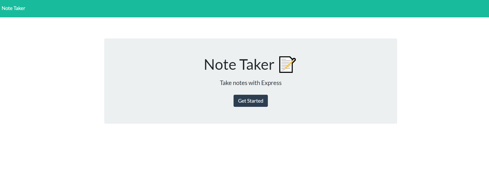
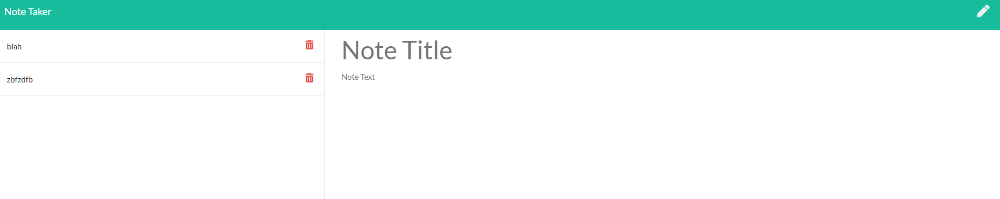

# Not3pad :metal:

 
 
This application is covered by the Mozilla license.

 ## Table of Contents
- [Description](#Description)
- [Installation](#Installation)
- [Usage](#Usage)
- [Lincense](#Lincense)
- [Contributing](#Contributing)
- [Tests](#Tests)
- [Questions](#Questions)

## Description  :clipboard:
Create an application that can be used to write, save, and delete notes. This application uses an express backend and save and retrieve note data from a JSON file.
 
Created with JS and love :heart:.

## Installation :floppy_disk:
No installation necessary

## Usage :warning:
Users can add notes of any size, and then save and/or delete them

## License :scroll:

 
This application is uses the Mozilla license. 

## Contributors :family:
Peter Izzo

Feel free to submit a pull request with any updates you would like to submit :)

## Tests 🧪

### Screenshot of Running App

## Live Application
https://safe-everglades-43471.herokuapp.com/notes

## Questions :question:
### For any issues please reach out to Peter Izzo
 
Feel free to reach out to me at  with any questions :wave: 
 
Check out the rest of my Github: https://github.com/peter-izzo :octocat: 
 

_This README was generated by [README-GEN](https://github.com/peter-izzo/README-GEN) :godmode:_

